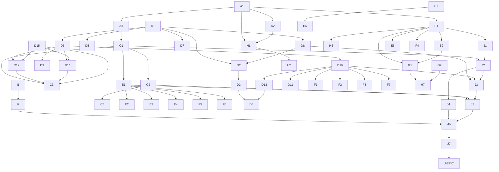

# Issue Plan

This file is the executable artefact of the case study. Each entry below is a planned GitHub issue with title, labels, body template, dependencies, and acceptance criteria.

**Status: filed.** All 67 planned issues plus the tracking epic have been filed on GitHub with full body, labels, and resolved `Depends on` / `Blocks` cross-references. See the [Filed-issue index](#filed-issue-index) at the bottom of this file for the planned-ID → GitHub-issue-number map. The tracking epic is [#95](https://github.com/link-foundation/relative-meta-logic/issues/95).

## Index

- [Naming and template conventions](#naming-and-template-conventions)
- [Label scheme](#label-scheme)
- [Phase A — Diagnostics and developer experience](#phase-a--diagnostics-and-developer-experience)
- [Phase B — Module system and namespaces](#phase-b--module-system-and-namespaces)
- [Phase C — Proof artefacts and trusted kernel](#phase-c--proof-artefacts-and-trusted-kernel)
- [Phase D — Typed kernel maturation](#phase-d--typed-kernel-maturation)
- [Phase E — Tactic and automation language](#phase-e--tactic-and-automation-language)
- [Phase F — Bridges to mature provers and ATP/SMT](#phase-f--bridges-to-mature-provers-and-atpsmt)
- [Phase G — Standard libraries](#phase-g--standard-libraries)
- [Phase H — Tooling and ecosystem](#phase-h--tooling-and-ecosystem)
- [Phase I — Multi-implementation parity](#phase-i--multi-implementation-parity)
- [Phase J — Self-reimplementation (capstone)](#phase-j-self-reimplementation-capstone)
- [Dependency graph](#dependency-graph)
- [Deliberate divergences](#deliberate-divergences)
- [Deferred items](#deferred)

---

## Naming and template conventions

Goal of the conventions: every encoded link **reads as an English sentence**. A reader who has never seen RML should be able to read a link aloud and understand what it says.

### Words used as templates

| Template | Reads as | Example |
|----------|----------|---------|
| `(<name>: <type> <name>)` | "name is a type" | `(zero: Natural zero)` reads "zero is a Natural" |
| `(<term> is <something>)` | English copula | `(zero is a Natural)` |
| `(<term> of <collection>)` | "X of Y" | `(zero of Natural)` reads "is zero of Natural?" |
| `(<term> has <attribute>)` | "X has Y" | `((rain = true) has probability 0.3)` |
| `(from <a> to <b>)` | function direction | `(double: function from Natural to Natural)` |
| `(Pi (<TypeName> <var>) <body>)` | "for any var of TypeName, body" | `(succ: (Pi (Natural n) Natural))` |
| `(lambda (<TypeName> <var>) <body>)` | "function of var: body" | `(identity: lambda (Natural x) x)` |
| `(? <expression>)` | "what is the truth of …?" | `(? (zero of Natural))` |
| `(if <condition> then <a> else <b>)` | English conditional | `(if (x = 0) then 1 else x)` (planned in phase D) |
| `(both <a> and <b>)` / `(neither <a> nor <b>)` | Belnap operators | already supported |
| `(suppose <hypothesis>)` | tactic-language tactic | `(suppose ((p) has probability 1))` (phase E) |
| `(by <reason>)` | proof step | `(by reflexivity)` (phase E) |
| `(rewrite <equation> in <goal>)` | rewrite tactic | (phase E) |

### Identifier style

- Words separated by hyphens, lowercase: `right-identity`, `liar-paradox`.
- Type names start with an uppercase letter: `Natural`, `Boolean`, `Type`.
- No CamelCase except for type names.
- No abbreviations unless universal: `Pi`, `lambda`, `id` are allowed; `nat` is not (use `Natural`).

### Anti-patterns

- `(f x y z)` with no English connector — replace with `(apply f to (x, y, z))` or define a named operator.
- Punctuation-only tokens — every operator should have a word-form alternative (`equals` for `=`, `not-equals` for `!=`).
- Identifiers that read as code rather than sentences (`fzz_log`, `lambdaT`).

### Style guard

A planned issue (**A5**) adds a lint that flags links violating these conventions in `lib/` and `examples/`.

---

## Label scheme

| Label | Existing? | Purpose |
|-------|-----------|---------|
| `bug` | yes | regressions surfaced during phase work |
| `documentation` | yes | docs-only changes |
| `enhancement` | yes | new features |
| `good first issue` | yes | scoped tasks safe for newcomers |
| `help wanted` | yes | external expertise needed (e.g. Lean export) |
| `question` | yes | spec/RFC issues |
| `area:diagnostics` | proposed | phase A |
| `area:modules` | proposed | phase B |
| `area:kernel` | proposed | phases C, D |
| `area:tactics` | proposed | phase E |
| `area:bridges` | proposed | phase F |
| `area:libraries` | proposed | phase G |
| `area:tooling` | proposed | phase H |
| `area:parity` | proposed | phase I |
| `phase:A`–`phase:J` | proposed | phase ordering |
| `capstone` | proposed | applied only to phase J epic |

`area:*` and `phase:*` labels make it possible to filter the issue tracker by the planning view.

---

## Issue body template

Every planned issue follows this template:

```markdown
## Motivation
<One paragraph stating the gap referenced from the comparison docs.>

## Goal
<One sentence stating the deliverable.>

## LiNo Surface
<Proposed `.lino` syntax. Show one minimal example and one realistic example.>

## API Surface
<Proposed JS/Rust function signatures, if any.>

## Acceptance Criteria
- [ ] <Bullet 1>
- [ ] <Bullet 2>
- [ ] Tests added in both JS and Rust (or split tracked in a parity issue).
- [ ] README/ARCHITECTURE updated as needed.

## References
- Comparison-doc rows: <link to row>
- Prior art: <library or paper link>
- Depends on: #<issue-number> (filed) or <issue-id> (planned)
- Blocks: <issue-id>(s)

## Out of Scope
<What this issue does *not* deliver.>
```

The plan entries below show the unique parts (motivation, goal, LiNo, API, criteria, deps); the rest of the template is implicit.

---

## Phase A — Diagnostics and developer experience

**Phase goal**: every parse/eval failure gives the user actionable, source-located feedback. This unblocks every other phase because users (and CI) need to see why something failed.

### A1 — Structured diagnostics with source spans

- **Labels**: `enhancement`, `area:diagnostics`, `phase:A`
- **Motivation**: Today, parser/evaluator errors are plain strings without spans. This makes IDE integration impossible.
- **Goal**: Every error returned by parser, evaluator, and (later) type checker is a structured `Diagnostic { code, message, span: { file, line, col } }`.
- **LiNo Surface**: n/a (host-language refactor).
- **API Surface**:
  - JS: `evaluate(code: string): { results: number[]; diagnostics: Diagnostic[] }`.
  - Rust: `pub fn evaluate(src: &str) -> EvaluateResult { results: Vec<f64>, diagnostics: Vec<Diagnostic> }`.
- **Acceptance**:
  - [ ] Every existing error path returns a `Diagnostic` instead of throwing.
  - [ ] Each `Diagnostic` carries an error code (e.g. `E001` for unknown symbol) listed in `docs/DIAGNOSTICS.md`.
  - [ ] CLI prints diagnostics with file:line:col and a caret (`^`) under the offending token.
- **Depends on**: none.
- **Blocks**: A2, A3, H1, H2.

### A2 — Interactive REPL

- **Labels**: `enhancement`, `area:diagnostics`, `phase:A`
- **Motivation**: Comparison doc lists REPL as `Part` for RML. Lean/Rocq/Isabelle have first-class REPLs.
- **Goal**: A REPL that maintains a persistent `Env` between user inputs and prints diagnostics inline.
- **LiNo Surface**:
  ```
  rml> (a: a is a)
  rml> ((a = a) has probability 1)
  rml> (? (a = a))
  1
  ```
- **API Surface**: `rml repl` subcommand in both implementations.
- **Acceptance**:
  - [ ] REPL preserves env across commands.
  - [ ] `:reset`, `:env`, `:load <file>`, `:save <file>` meta-commands.
  - [ ] Tab-completion of declared symbols (best-effort).
  - [ ] Tests cover state preservation and meta-commands.
- **Depends on**: A1.
- **Blocks**: H1.

### A3 — Trace mode for evaluation

- **Labels**: `enhancement`, `area:diagnostics`, `phase:A`
- **Goal**: `--trace` flag prints every reduction step, operator resolution, and assignment lookup with span info.
- **LiNo Surface**:
  ```
  $ rml --trace demo.lino
  [span demo.lino:3:1] resolve (and: avg)
  [span demo.lino:5:1] eval (a = a) → assigned 1
  ```
- **Acceptance**:
  - [ ] Trace output is reproducible (no nondeterminism).
  - [ ] Tests verify trace lines for representative programs.
- **Depends on**: A1.
- **Blocks**: C1.

### A4 — Document operator-redefinition design rationale

- **Labels**: `documentation`, `area:diagnostics`, `phase:A`, `good first issue`
- **Goal**: Add `docs/CONFIGURABILITY.md` capturing why every operator is redefinable, the precedence rules at runtime, and how this differs from Lean/Rocq fixed semantics.
- **Acceptance**: [ ] `docs/CONFIGURABILITY.md` is linked from the README and explains range, valence, operator, aggregator, and truth-constant configuration.
- **Depends on**: none.

### A5 — English-readability lint for `lib/` and `examples/`

- **Labels**: `enhancement`, `area:diagnostics`, `phase:A`, `good first issue`
- **Goal**: A small lint script that flags links violating the [naming conventions](#naming-and-template-conventions): operator-only links without word-form alternatives, identifiers without hyphens, etc.
- **API**: `scripts/lint-english.mjs <files...>`.
- **Acceptance**: [ ] CI fails if `examples/` or `lib/` (when introduced) contain violations.
- **Depends on**: none.
- **Blocks**: G1, J7.

---

## Phase B — Module system and namespaces

**Phase goal**: scale beyond single-file demos. Required for libraries (phase G) and for the self-bootstrap (phase J).

### B1 — File imports with cycle detection

- **Labels**: `enhancement`, `area:modules`, `phase:B`
- **Motivation**: Comparison doc rows "Module/import system" and "Namespaces" are `Part`/`No` for RML.
- **Goal**: Add `(import "<relative-path>.lino")` that loads another file's declarations into the current env. Cycles produce a structured diagnostic.
- **LiNo Surface**:
  ```
  (import "lib/classical-logic.lino")
  ```
- **Acceptance**:
  - [ ] Cycle detection with span-aware error.
  - [ ] Caching: each file is loaded once.
  - [ ] Tests cover linear chains, diamonds, and cycles.
- **Depends on**: A1.
- **Blocks**: B2, G1, H5, J1.

### B2 — Namespaces and qualified references

- **Labels**: `enhancement`, `area:modules`, `phase:B`
- **Goal**: A file can declare `(namespace classical)` and exported names become `classical.true`, `classical.and`, etc. Imports can be aliased via `(import "lib/classical.lino" as cl)`.
- **LiNo Surface**:
  ```
  (namespace classical)
  (and: min)
  (or: max)
  ```
  imported as:
  ```
  (import "classical.lino" as cl)
  (? (cl.and 1 0))
  ```
- **Acceptance**:
  - [ ] Qualified references resolve correctly.
  - [ ] Re-binding a name in the importing file shadows the imported one with a warning diagnostic.
- **Depends on**: B1.
- **Blocks**: G1.

---

## Phase C — Proof artefacts and trusted kernel

**Phase goal**: every query returns an auditable derivation. A small independent checker can replay the derivation and produce the same result. This is what "machine-checked proof terms" means in RML's substrate.

### C1 — Proof-producing evaluator

- **Labels**: `enhancement`, `area:kernel`, `phase:C`
- **Motivation**: Concept rows "Machine-checked proof terms" and "Proof-producing evaluator" are `No`/`Part`.
- **Goal**: Each query optionally returns a derivation tree consisting of links: `(by <rule> <subderivations>)`.
- **LiNo Surface (output)**:
  ```
  (? (a = a) with proof) →
    1
    (by structural-equality (a a))
  ```
- **API Surface**:
  - JS: `evaluate(src, { withProofs: true })` returns `{ results, proofs }`.
  - Rust: `Evaluator::with_proofs(true)`.
- **Acceptance**:
  - [ ] All built-in operators produce derivations.
  - [ ] Derivations are themselves links and can be printed as `.lino`.
  - [ ] Round-trip test: parse(print(derivation)) == derivation.
- **Depends on**: A3.
- **Blocks**: C2, C3, E1, J2.

### C2 — Independent proof-replay checker

- **Labels**: `enhancement`, `area:kernel`, `phase:C`
- **Goal**: A separate executable `rml-check` consumes a `.lino` file containing both the program and its derivation tree and verifies that the derivation produces the claimed truth value.
- **API Surface**: `rml-check program.lino proofs.lino`.
- **Acceptance**:
  - [ ] Checker depends only on the kernel (no evaluator).
  - [ ] Tests verify that mutated proof trees fail.
  - [ ] Checker's source is small (target: ≤ 500 LOC) so it can be audited.
- **Depends on**: C1.
- **Blocks**: C3, J5.

### C3 — Metatheorem checker over encoded systems

- **Labels**: `enhancement`, `area:kernel`, `phase:C`
- **Goal**: Given a relation defined as a family of links plus a totality declaration (D12) and modes (D15), check that the relation is a total function on its declared domain.
- **LiNo Surface**:
  ```
  (relation plus
    (plus zero (Natural n) n)
    (plus (succ m) (Natural n) (succ (plus m n))))
  (mode plus +input +input -output)
  (total plus)
  ```
- **Acceptance**: [ ] Pass/fail diagnostic with counter-witness on failure.
- **Depends on**: C1, C2, D12, D14, D15.
- **Blocks**: J5.

### C5 — Soundness statement

- **Labels**: `documentation`, `area:kernel`, `phase:C`
- **Goal**: Add `docs/SOUNDNESS.md` explaining what the trusted kernel guarantees and which operators are part of the trusted base. (Note: in a paradox-tolerant logic, soundness is stated relative to a chosen aggregator family.)
- **Acceptance**: [ ] Doc reviewed by maintainer; linked from README.
- **Depends on**: C2.

---

## Phase D — Typed kernel maturation

**Phase goal**: turn the prototype type layer into a documented, checked kernel without losing the "every operator is redefinable" property.

### D1 — Promote dependent types and Pi to a documented kernel

- **Labels**: `enhancement`, `area:kernel`, `phase:D`
- **Goal**: Specify the typing rules for `(Pi …)`, `(lambda …)`, `apply`, type membership `(of)` in `docs/KERNEL.md`.
- **Acceptance**: [ ] Doc + tests for each rule. [ ] Existing examples checked against the spec.
- **Depends on**: A1, C1.

### D2 — Beta reduction in the evaluator

- **Goal**: `(apply (lambda (Natural x) (x + 1)) 0)` reduces to `1` via β.
- **Acceptance**: [ ] β-reduction tests for closed and open terms. [ ] Capture-avoidance respected (uses D8).
- **Depends on**: D1, D8.

### D3 — Definitional equality / convertibility

- **Goal**: An equality decision procedure that handles β, η (optional), and assignment lookup.
- **Acceptance**: [ ] Test cases from the comparison-doc "Definitional equality" row pass.
- **Depends on**: D2.

### D4 — Full normalization for typed fragment

- **Goal**: Implement weak-head normal form and full normal form for typed link terms.
- **Acceptance**: [ ] Termination proven for the typed fragment by D13. [ ] Tests cover Church numerals normalisation.
- **Depends on**: D2, D13.

### D5 — Universe hierarchy as a checked layer

- **Goal**: `(Type 0)`, `(Type 1)`, … become checked levels; `((Type 0) of (Type 1))` returns 1, `((Type 1) of (Type 0))` returns 0.
- **Acceptance**: [ ] Test matrix across levels. [ ] Coexistence with self-referential `(Type: Type Type)` documented and tested.
- **Depends on**: D1.

### D6 — Bidirectional type checker

- **Goal**: A type checker with check/synthesize modes; produces structured diagnostics on failure.
- **Acceptance**: [ ] Pass on every `examples/dependent-types.lino` declaration. [ ] Failure cases checked.
- **Depends on**: D1, D2, D3, D5.

### D7 — Higher-order abstract syntax (HOAS) helpers

- **Goal**: Provide a documented HOAS encoding pattern (binders represented as `lambda` of the host) plus convenience helpers for common cases (e.g. `(forall (Natural x) body)` desugaring to `(Pi (Natural x) body)`).
- **Acceptance**: [ ] Lambda-calculus example uses HOAS and round-trips.
- **Depends on**: D1, D2.

### D8 — Capture-avoiding substitution and freshness

- **Goal**: Kernel primitive for substitution; `nabla`-style freshness quantifier `(fresh x in body)`.
- **Acceptance**: [ ] Substitution tests for all binder forms. [ ] `(fresh x in body)` rejected when `x` already appears in the context.
- **Depends on**: D1.
- **Blocks**: D2, D7, J3.

### D9 — Prenex polymorphism

- **Goal**: Allow `(forall A (Pi (A x) A))` style polymorphic types in declarations.
- **Acceptance**: [ ] Type checker handles polymorphic identity, polymorphic apply, polymorphic compose.
- **Depends on**: D6.

### D10 — Inductive families with eliminators

- **Goal**: First-class inductive declarations encoded as link signatures plus a generated eliminator.
- **LiNo Surface**:
  ```
  (inductive Natural
    (constructor zero)
    (constructor (succ (Pi (Natural n) Natural))))
  ```
  generates:
  ```
  (Natural-rec
    (lambda (Type C)
      (lambda (C base)
        (lambda (Pi (Natural n) (Pi (C ih) C)) step)
        (lambda (Natural target) ...))))
  ```
- **Acceptance**: [ ] Lists, vectors, and propositional equality definable. [ ] Eliminator type-checks.
- **Depends on**: D6, D8.
- **Blocks**: G7, J3.

### D11 — Coinductive families and productivity

- **Goal**: `coinductive` declarations plus a productivity check based on guarded corecursion.
- **Acceptance**: [ ] Streams definable; non-productive defs rejected.
- **Depends on**: D10.

### D12 — Totality checking (Twelf-style)

- **Goal**: Given a relation with declared modes, decide whether it is total.
- **Acceptance**: [ ] Plus, less-than-or-equal, append on lists checked total. [ ] Counter-witness on failure.
- **Depends on**: D6, D15.
- **Blocks**: C3.

### D13 — Termination checking

- **Goal**: Recursive definitions must reduce a structural-order argument; decreasing-order checks.
- **Acceptance**: [ ] Ackermann rejected without explicit measure; with a measure, accepted.
- **Depends on**: D10.
- **Blocks**: D4, D12.

### D14 — Coverage checking for case-style relations

- **Goal**: Every input pattern that the relation can match must be covered.
- **Acceptance**: [ ] Missing case produces a structured diagnostic with example.
- **Depends on**: D10, D15.

### D15 — Mode declarations

- **Goal**: Each relation argument is `+input`, `-output`, or `*either`; checked by D12 and D14.
- **Acceptance**: [ ] Mode mismatches rejected.
- **Depends on**: D6.

### D16 — World declarations

- **Goal**: Twelf `%worlds` analogue for declaring which constants may appear free in a relation's arguments.
- **Acceptance**: [ ] World violations produce a diagnostic. [ ] Optional — gated behind a feature flag if it complicates the kernel.
- **Depends on**: D8, D15.

---

## Phase E — Tactic and automation language

**Phase goal**: provide named, composable proof steps without losing the "everything is a link" property.

### E1 — Tactic language as links

- **Labels**: `enhancement`, `area:tactics`, `phase:E`
- **Goal**: Tactics are links interpreted by a tactic engine; they transform a proof state. Examples: `(by reflexivity)`, `(by symmetry)`, `(by transitivity <intermediate>)`, `(suppose <hypothesis>)`, `(introduce <variable>)`.
- **LiNo Surface**:
  ```
  (theorem plus-zero (Pi (Natural n) ((plus n zero) = n))
    (proof
      (induction n
        (case zero (by reflexivity))
        (case (succ m) (rewrite (induction-hypothesis m) in goal)))))
  ```
- **Acceptance**: [ ] Built-in tactics: reflexivity, symmetry, transitivity, induction, suppose, introduce, by, rewrite, exact. [ ] Failed tactic produces structured diagnostic with current goal printed.
- **Depends on**: C1.
- **Blocks**: E2, E3, J5.

### E2 — Simplifier and rewriting

- **Goal**: `(simplify in <goal>)` applies a configured rewrite set; `(rewrite <eq> in <goal>)` uses a single equation; congruence handled by walking the link tree.
- **Acceptance**: [ ] Tests cover direction of rewriting, occurrence selection, and termination guard.
- **Depends on**: E1, D3.

### E3 — Bounded proof search

- **Goal**: `(by search depth N)` performs depth-bounded backwards search using available lemmas.
- **Acceptance**: [ ] Depth budget honoured. [ ] Search returns a derivation tree, not just a yes/no.
- **Depends on**: E1.

### E4 — Counter-model finder for finite valences

- **Goal**: For finite-valence configurations, exhaustively search valuations to find a falsifying witness.
- **Acceptance**: [ ] Demonstrates that excluded middle is non-tautological in 3-valued Kleene.
- **Depends on**: E1.

### E5 — Macro / template mechanism for reusable link shapes

- **Goal**: A `template` declaration that names a link shape with placeholders; uses are expanded before evaluation.
- **LiNo Surface**:
  ```
  (template (commutative-and a b)
    (theorem (and a b) = (and b a)))
  ```
- **Acceptance**: [ ] Hygienic expansion. [ ] Tests for nested templates.
- **Depends on**: B1.

---

## Phase F — Bridges to mature provers and ATP/SMT

**Phase goal**: make RML interoperable with the larger formal-methods world. None of these are required for self-bootstrap, but they unlock external certification.

### F1 — Lean 4 export of RML fragments

- **Labels**: `enhancement`, `area:bridges`, `phase:F`, `help wanted`
- **Goal**: Translate a typed link fragment (no probabilistic operators) into Lean 4 source.
- **Acceptance**: [ ] Round-trip test on a set of examples. [ ] Documentation for the supported subset.
- **Depends on**: D6, D10.

### F2 — Rocq export

- Same as F1 for Rocq.
- **Depends on**: D6, D10.

### F3 — Isabelle export

- Same as F1 for Isabelle/Pure or Isabelle/HOL.
- **Depends on**: D6, D10.

### F4 — Pecan-style automatic-sequence backend (optional)

- **Goal**: A plugin that ships decisions about Buchi automata when the user declares the problem inside a `(domain automatic-sequences)` block.
- **Acceptance**: [ ] At least one classic example (e.g. Thue–Morse word) decided.
- **Depends on**: B1.

### F5 — SMT-LIB bridge

- **Goal**: `(by smt)` tactic dispatches to a configured SMT solver; the result is wrapped as a derivation node `(by smt-trusted <solver>)`.
- **Acceptance**: [ ] Solver path configurable. [ ] Failure modes tested (timeout, unknown).
- **Depends on**: E1.

### F6 — TPTP bridge for first-order ATPs

- Same idea as F5 for TPTP-format ATPs.
- **Depends on**: E1.

### F7 — Program extraction to JS / Rust

- **Goal**: Typed link programs without probabilistic operators extract to clean JS or Rust source.
- **Acceptance**: [ ] Extracted code passes its own tests.
- **Depends on**: D10.

---

## Phase G — Standard libraries

**Phase goal**: ship reusable libraries under `lib/`, organised by topic, all written in English-readable links.

Naming convention: `lib/<topic>/<file>.lino` with a `(namespace <topic>)` line at the top.

| ID | Library | Contents |
|----|---------|----------|
| G1 | `lib/classical/` | Boolean operators, classical ND rules, excluded middle, double negation, De Morgan. |
| G2 | `lib/first-order/` | Quantifiers using `(forall (Type X) body)` / `(exists …)`. |
| G3 | `lib/higher-order/` | HOL-style quantification over predicates. |
| G4 | `lib/modal/` | K, T, S4, S5 axioms; Kripke-frame interpretation. |
| G5 | `lib/provability/` | GL axioms; interpretability fragment. |
| G6 | `lib/set-theory/` | Extensionality, pairing, union, separation, replacement, infinity. |
| G7 | `lib/arithmetic/` | Peano axioms, decimal-precision lemmas, `<`, `≤`. |
| G8 | `lib/algebra/` | Magma, monoid, group, ring (long-term, may be deferred). |
| G9 | `lib/programming-language/` | Untyped λ-calculus, STLC, type safety. |
| G10 | `lib/probabilistic/` | Bayesian-network helpers, fuzzy-control example, Belnap-bilattice helpers, paradox catalogue. |

Per-library acceptance: [ ] Each library file has a header comment with English summary. [ ] Each has its own test file in `js/test/lib-<topic>.test.mjs` and Rust equivalent. [ ] Each is referenced from the README.

**Depends on**: A5, B1, B2, D6, D10, E1.

---

## Phase H — Tooling and ecosystem

### H1 — Language Server Protocol implementation

- **Labels**: `enhancement`, `area:tooling`, `phase:H`
- **Goal**: An LSP server that wraps the JS or Rust evaluator and exposes diagnostics, hover documentation, go-to-definition, and (optional) completion.
- **Acceptance**: [ ] LSP server passes a smoke-test suite. [ ] Documented setup for Neovim/Helix.
- **Depends on**: A1, A2, A3.

### H2 — VS Code extension

- **Goal**: A VS Code extension that consumes the LSP from H1 and adds syntax highlighting plus a `.lino` language config.
- **Depends on**: H1.

### H3 — Generated API/reference docs

- **Goal**: JSDoc and rustdoc generation; published to GitHub Pages on release.
- **Depends on**: none.

### H4 — Backward-compatibility policy + release process

- **Goal**: `docs/COMPATIBILITY.md` describing semver application to JS and Rust crates, deprecation procedure, and release cadence.
- **Depends on**: none.

### H5 — Literate `.lino` format

- **Goal**: Allow `.lino.md` files where prose and code blocks alternate; tooling extracts code blocks for evaluation.
- **Depends on**: B1.

### H6 — Online wasm playground

- **Goal**: A small static site that runs the JS or wasm-compiled Rust evaluator in the browser; supports examples and shareable URLs.
- **Depends on**: H3.

### H7 — Tutorials and walkthroughs

- **Goal**: `docs/tutorials/` with progressively richer walkthroughs: classical → fuzzy → probabilistic → typed → metatheory → self-bootstrap.
- **Depends on**: G1, G7, J7.

### H8 — Docker support

- **Goal**: `Dockerfile` and `docker-compose.yml` for both implementations.
- **Depends on**: none.

---

## Phase I — Multi-implementation parity

### I1 — Shared test corpus

- **Labels**: `enhancement`, `area:parity`, `phase:I`
- **Goal**: Move the test corpus into a shared `test-corpus/` folder consumed by both JS and Rust suites.
- **Depends on**: none.

### I2 — Parity CI job

- **Goal**: A CI job that runs every `test-corpus/*.lino` through both JS and Rust and asserts identical output.
- **Depends on**: I1.

---

## Phase J — Self-reimplementation (capstone)

**Phase goal**: encode RML inside RML; demonstrate that the encoded RML reproduces the host RML's behaviour. This is the capstone of issue #26.

### J1 — Encode the LiNo grammar as links

- **Labels**: `enhancement`, `capstone`, `phase:J`
- **Goal**: A `lib/self/grammar.lino` describing the LiNo grammar as link rules. The grammar is interpretable by an in-RML parser.
- **Acceptance**: [ ] Grammar parses every example in `examples/`. [ ] Produces the same AST as the host parser (modulo presentation).
- **Depends on**: B1, B2, A5.

### J2 — Encode the evaluator as links

- **Goal**: `lib/self/evaluator.lino` describing the evaluation rules of every built-in operator. Reads as a list of `(rule …)` links.
- **Acceptance**: [ ] Encoded evaluator reproduces host outputs on the example corpus. [ ] Tests in `test-corpus/self/` cross-check.
- **Depends on**: J1, C1.

### J3 — Encode the type layer as links

- **Goal**: `lib/self/types.lino` describing the typing rules.
- **Acceptance**: [ ] Encoded type checker accepts/rejects the same programs as the host.
- **Depends on**: J2, D6, D8, D10.

### J4 — Encode operators and aggregators as links

- **Goal**: `lib/self/operators.lino` containing a relation per operator (avg, min, max, product, probabilistic_sum, decimal arithmetic).
- **Acceptance**: [ ] Encoded operator outputs match host outputs to 12 decimal places.
- **Depends on**: J2.

### J5 — Encode the metatheorem checker as links

- **Goal**: `lib/self/metatheorem.lino` describing the totality, termination, coverage, mode, and world checks (subject to availability — D12–D16).
- **Depends on**: J3, C2, C3, D12, D13, D14, D15.

### J6 — Bootstrap test: encoded RML evaluates the example corpus

- **Goal**: A CI job runs every `test-corpus/*.lino` through the encoded RML (driven by the host RML) and asserts identical output to the host RML.
- **Depends on**: J2, J3, J4, J5, I2.

### J7 — Tutorial: "RML in RML"

- **Goal**: `docs/tutorials/self-bootstrap.md` walking through the encoded files in narrative order, suitable for a beginner.
- **Acceptance**: [ ] Reviewed by maintainer. [ ] Linked from README.
- **Depends on**: J1–J6.

### J-EPIC — Tracking issue: "Universal formal-system constructor: feature-parity audit"

- **Labels**: `enhancement`, `capstone`, `phase:J`
- **Body**: References every other planned issue and tracks completion against the comparison-doc rows.

---

## Dependency graph

The DAG below uses Mermaid syntax and renders inside GitHub. Arrows go from prerequisite to dependent (`A → B` means "A blocks B").



---

## Deliberate divergences

These rows in the comparison docs will **not** become parity issues. Each is documented in the upcoming `docs/PHILOSOPHY.md` (planned as A4 / H4 follow-up).

| Row | Reason |
|-----|--------|
| Type classes (Concepts §Type Theory and Binding) | RML uses runtime operator redefinition, which subsumes type-class-style overloading without a fixed dispatch mechanism. |
| Proof irrelevance (Concepts §Metatheory) | RML's equality is probabilistic; proof irrelevance is replaced by aggregator semantics. |
| Termination of every recursive definition | RML's evaluator embraces fixed-point semantics where productive non-terminating definitions are useful (see liar paradox); termination is **opt-in** (D13) for the typed fragment only. |
| Self-reference rejected by stratification | RML accepts self-reference as ordinary data (paradox-tolerant midpoint). This is core to the project. |

---

## Deferred

These are out of scope for the initial plan but are noted so they are not lost.

- Proof repair / refactoring tools (depends on tactics + LSP being mature).
- Ecosystem package manager beyond npm/cargo (e.g. an `rml-pkg` registry).
- Full mathematics library beyond G7/G8 (mathlib-scale work).
- AFP-style scientific archive (depends on a critical mass of libraries first).

These items belong in a follow-up plan once phases A–J have stabilised.

---

## Filed-issue index

The table below maps every planned issue ID to its filed GitHub issue number. All `Depends on` / `Blocks` lines in each filed issue use the GitHub numbers shown here. The tracking epic ([#95](https://github.com/link-foundation/relative-meta-logic/issues/95), `J-EPIC`) consolidates the full task list with checkboxes per phase.

| Plan ID | GitHub | Title |
|---------|--------|-------|
| A1 | [#28](https://github.com/link-foundation/relative-meta-logic/issues/28) | Structured diagnostics with source spans |
| A2 | [#29](https://github.com/link-foundation/relative-meta-logic/issues/29) | Interactive REPL |
| A3 | [#30](https://github.com/link-foundation/relative-meta-logic/issues/30) | Trace mode for evaluation |
| A4 | [#31](https://github.com/link-foundation/relative-meta-logic/issues/31) | Document operator-redefinition design rationale |
| A5 | [#32](https://github.com/link-foundation/relative-meta-logic/issues/32) | English-readability lint for `lib/` and `examples/` |
| B1 | [#33](https://github.com/link-foundation/relative-meta-logic/issues/33) | File imports with cycle detection |
| B2 | [#34](https://github.com/link-foundation/relative-meta-logic/issues/34) | Namespaces and qualified references |
| C1 | [#35](https://github.com/link-foundation/relative-meta-logic/issues/35) | Proof-producing evaluator |
| C2 | [#36](https://github.com/link-foundation/relative-meta-logic/issues/36) | Independent proof-replay checker |
| C3 | [#47](https://github.com/link-foundation/relative-meta-logic/issues/47) | Metatheorem checker over encoded systems |
| C5 | [#48](https://github.com/link-foundation/relative-meta-logic/issues/48) | Soundness statement |
| D1 | [#37](https://github.com/link-foundation/relative-meta-logic/issues/37) | Promote dependent types and Pi to a documented kernel |
| D2 | [#39](https://github.com/link-foundation/relative-meta-logic/issues/39) | Beta reduction in the evaluator |
| D3 | [#40](https://github.com/link-foundation/relative-meta-logic/issues/40) | Definitional equality / convertibility |
| D4 | [#50](https://github.com/link-foundation/relative-meta-logic/issues/50) | Full normalization for typed fragment |
| D5 | [#41](https://github.com/link-foundation/relative-meta-logic/issues/41) | Universe hierarchy as a checked layer |
| D6 | [#42](https://github.com/link-foundation/relative-meta-logic/issues/42) | Bidirectional type checker |
| D7 | [#51](https://github.com/link-foundation/relative-meta-logic/issues/51) | Higher-order abstract syntax (HOAS) helpers |
| D8 | [#38](https://github.com/link-foundation/relative-meta-logic/issues/38) | Capture-avoiding substitution and freshness |
| D9 | [#52](https://github.com/link-foundation/relative-meta-logic/issues/52) | Prenex polymorphism |
| D10 | [#45](https://github.com/link-foundation/relative-meta-logic/issues/45) | Inductive families with eliminators |
| D11 | [#53](https://github.com/link-foundation/relative-meta-logic/issues/53) | Coinductive families and productivity |
| D12 | [#44](https://github.com/link-foundation/relative-meta-logic/issues/44) | Totality checking (Twelf-style) |
| D13 | [#49](https://github.com/link-foundation/relative-meta-logic/issues/49) | Termination checking |
| D14 | [#46](https://github.com/link-foundation/relative-meta-logic/issues/46) | Coverage checking for case-style relations |
| D15 | [#43](https://github.com/link-foundation/relative-meta-logic/issues/43) | Mode declarations |
| D16 | [#54](https://github.com/link-foundation/relative-meta-logic/issues/54) | World declarations |
| E1 | [#55](https://github.com/link-foundation/relative-meta-logic/issues/55) | Tactic language as links |
| E2 | [#56](https://github.com/link-foundation/relative-meta-logic/issues/56) | Simplifier and rewriting |
| E3 | [#57](https://github.com/link-foundation/relative-meta-logic/issues/57) | Bounded proof search |
| E4 | [#58](https://github.com/link-foundation/relative-meta-logic/issues/58) | Counter-model finder for finite valences |
| E5 | [#59](https://github.com/link-foundation/relative-meta-logic/issues/59) | Macro / template mechanism for reusable link shapes |
| F1 | [#60](https://github.com/link-foundation/relative-meta-logic/issues/60) | Lean 4 export of RML fragments |
| F2 | [#61](https://github.com/link-foundation/relative-meta-logic/issues/61) | Rocq export |
| F3 | [#62](https://github.com/link-foundation/relative-meta-logic/issues/62) | Isabelle export |
| F4 | [#63](https://github.com/link-foundation/relative-meta-logic/issues/63) | Pecan-style automatic-sequence backend |
| F5 | [#64](https://github.com/link-foundation/relative-meta-logic/issues/64) | SMT-LIB bridge |
| F6 | [#65](https://github.com/link-foundation/relative-meta-logic/issues/65) | TPTP bridge for first-order ATPs |
| F7 | [#66](https://github.com/link-foundation/relative-meta-logic/issues/66) | Program extraction to JS / Rust |
| G1 | [#67](https://github.com/link-foundation/relative-meta-logic/issues/67) | Standard library: classical logic |
| G2 | [#69](https://github.com/link-foundation/relative-meta-logic/issues/69) | Standard library: first-order logic |
| G3 | [#70](https://github.com/link-foundation/relative-meta-logic/issues/70) | Standard library: higher-order logic |
| G4 | [#71](https://github.com/link-foundation/relative-meta-logic/issues/71) | Standard library: modal logic |
| G5 | [#72](https://github.com/link-foundation/relative-meta-logic/issues/72) | Standard library: provability logic |
| G6 | [#73](https://github.com/link-foundation/relative-meta-logic/issues/73) | Standard library: set theory |
| G7 | [#74](https://github.com/link-foundation/relative-meta-logic/issues/74) | Standard library: arithmetic |
| G8 | [#75](https://github.com/link-foundation/relative-meta-logic/issues/75) | Standard library: algebra |
| G9 | [#76](https://github.com/link-foundation/relative-meta-logic/issues/76) | Standard library: programming-language theory |
| G10 | [#77](https://github.com/link-foundation/relative-meta-logic/issues/77) | Standard library: probabilistic / Belnap |
| H1 | [#78](https://github.com/link-foundation/relative-meta-logic/issues/78) | Language Server Protocol implementation |
| H2 | [#79](https://github.com/link-foundation/relative-meta-logic/issues/79) | VS Code extension |
| H3 | [#80](https://github.com/link-foundation/relative-meta-logic/issues/80) | Generated API/reference docs |
| H4 | [#81](https://github.com/link-foundation/relative-meta-logic/issues/81) | Backward-compatibility policy + release process |
| H5 | [#82](https://github.com/link-foundation/relative-meta-logic/issues/82) | Literate `.lino` format |
| H6 | [#83](https://github.com/link-foundation/relative-meta-logic/issues/83) | Online wasm playground |
| H7 | [#93](https://github.com/link-foundation/relative-meta-logic/issues/93) | Tutorials and walkthroughs |
| H8 | [#94](https://github.com/link-foundation/relative-meta-logic/issues/94) | Docker support |
| I1 | [#89](https://github.com/link-foundation/relative-meta-logic/issues/89) | Shared test corpus |
| I2 | [#90](https://github.com/link-foundation/relative-meta-logic/issues/90) | Parity CI job |
| J1 | [#84](https://github.com/link-foundation/relative-meta-logic/issues/84) | Encode the LiNo grammar as links |
| J2 | [#85](https://github.com/link-foundation/relative-meta-logic/issues/85) | Encode the evaluator as links |
| J3 | [#86](https://github.com/link-foundation/relative-meta-logic/issues/86) | Encode the type layer as links |
| J4 | [#87](https://github.com/link-foundation/relative-meta-logic/issues/87) | Encode operators and aggregators as links |
| J5 | [#88](https://github.com/link-foundation/relative-meta-logic/issues/88) | Encode the metatheorem checker as links |
| J6 | [#91](https://github.com/link-foundation/relative-meta-logic/issues/91) | Bootstrap test: encoded RML evaluates the example corpus |
| J7 | [#92](https://github.com/link-foundation/relative-meta-logic/issues/92) | Tutorial: "RML in RML" |
| J-EPIC | [#95](https://github.com/link-foundation/relative-meta-logic/issues/95) | Universal formal-system constructor: feature-parity audit |

Total: 67 planned issues + 1 tracking epic = 68 GitHub issues. Filed in topological order so every `Depends on #N` resolves immediately.

The filing tooling lives in [`experiments/issue-26-filing/`](https://github.com/link-foundation/relative-meta-logic/tree/main/experiments/issue-26-filing) (`issues.json` + `file-issues.mjs` + `validate.mjs`) and is reusable for future plan updates.

---

## Summary

The plan distils into **67 issues** across 10 phases plus one tracking epic. The dependency graph in this file has been validated visually; the filing order followed:

1. Phase A first (5 issues), all unblocked.
2. Phases B and D-foundations (D1, D8) once A1 lands.
3. Phase C (C1, C2, C3, C5) once A3 and D-foundations land.
4. Phases D-completion, E, G in parallel.
5. Phase F (bridges) and H (tooling) opportunistically.
6. Phase I parity job alongside any new feature.
7. Phase J last, with the tracking epic created at the **start** of the project so it can accumulate links as the other issues land.
